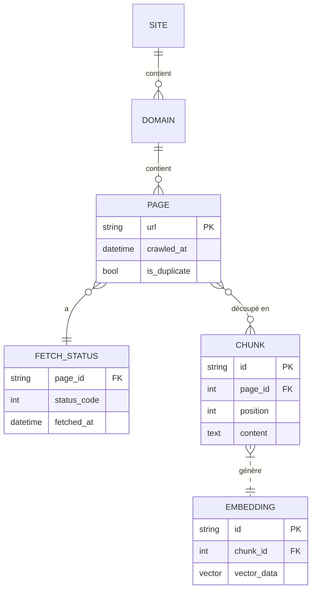

# Résumé exécutif  
Cet état de l’art couvre les outils open source et les architectures pour un crawler web continu en Python, conteneurisé et self‑hosted, visant à alimenter une base de données vectorielle. On y trouve un panorama complet des frameworks de crawling (Scrapy, Selenium, Playwright, etc.), des solutions distribuées (Scrapy Cluster, Frontera, Nutch, Heritrix), et des orchestrateurs (Airflow, Celery, Kafka). Chaque solution est décrite avec son but, licence, maturité, langues, forces et limites.  

Nous listons aussi les bibliothèques d’extraction multi‑format (HTML, PDF, images, audio, vidéo, DOCX) avec des exemples Python. L’architecture d’un crawler scalable est détaillée : fetchers, parsers, déduplication, files d’attente, scheduler, rate limiter, pool de proxies, stockage, vectorisation, base vectorielle, etc. On discute du déploiement (Docker/Kubernetes), montée en charge, résilience, monitoring, logs, sécurité, robots.txt et conformité. 

Côté indexation, on compare Milvus, Weaviate, Qdrant, FAISS, et alternatives à Pinecone dans un tableau (fonctionnalités, persistance, sharding, API, clients Python, ressources, licences). Pour les embeddings, on présente OpenAI, HuggingFace, sentence-transformers, et autres solutions on‑premise, ainsi que le pipeline d’ingestion (chunking, dédup, méta, provenance). 

Des exemples d’architectures (diagrammes Mermaid) et des tableaux comparatifs illustrent ces concepts. Nous fournissons aussi une estimation indicative des coûts infra (CPU, RAM, stockage) pour extraire 1k/10k/100k pages par jour, ainsi que des recommandations de tests et benchmarks. Les sources sont issues de documentations officielles, dépôts GitHub et articles techniques pertinents.

## 1. Frameworks Python de crawling  

- **Scrapy (BSD-3-Clause)**【10†L360-L364】: framework « haut niveau » de crawling Python, très populaire et mature (60k+★ GitHub). Rapide, extensible, spider-friendly, gère pipelines (logging, throttling, exporter, etc.)【10†L331-L340】. Points forts : communautés large, écosystème d’extensions. Limites : ne gère pas le JavaScript (mais extensions Splash/Puppeteer existent). Scalabilité : conçu pour des crawls massifs sur un seul ou plusieurs serveurs; supporte le **Scrapy-Redis** pour distribution. Intégration : récupère l’HTML brut exploitable par Trafilatura/Newspaper/etc., puis les textes peuvent alimenter un moteur d’embeddings.  

- **Selenium (Apache 2.0)**【12†L1230-L1232】: bibliothèque d’automatisation de navigateurs, mature (10+ ans), supporte Python, Java, etc. Objectif : interagir avec pages JS (formulaires, SPAs). Forces : rendu complet (JS), bon pour sites dynamiques complexes. Faiblesses : lenteur (browser lourd), détectable (bots), difficile à scaler en masse. En pratique, utilisé ponctuellement pour scraping de sites JS-only, souvent en combinaison avec BeautifulSoup pour parser. Intégration embeddings : pareille que Scrapy, on récupère du HTML/text depuis Selenium, puis on processe.  

- **Playwright (Apache 2.0)**【15†L42-L49】: framework open-source Microsoft, plus moderne que Selenium. Multi-navigateurs (Chromium, Firefox, WebKit) et API Python. Rendu headless efficace. Permet facilement la gestion d’onglets, contextes, etc. Résilient et plus rapide que Selenium. Point faible : comme Selenium, nécessite des navigateurs conteneurisés. License Apache 2.0【15†L42-L49】. Devenant très populaire pour scraping JS, avec bonne documentation.  

- **Newspaper3k (MIT/Apache)**【22†L25-L33】: lib Python dédiée à l’extraction d’articles de presse. Licence MIT/Apache. Simplicité d’usage: donne URL d’article → `.download()` + `.parse()` génèrent texte, auteurs, date, image, mots-clés, résumé【17†L28-L37】【20†L319-L328】. Forces : extraction d’articles multilingue prête à l’emploi (10+ langues), reconnaissance automatique de la langue. Faiblesses : plutôt limitée aux pages « type blog/article »; pas adaptée à un crawl généraliste (pas de gestion des liens internes). Bon pour pipeline d’indexation sur des contenus presse/news.  

- **Trafilatura (Apache 2.0)**【24†L42-L50】【24†L139-L143】: librairie/outil CLI pour extraire le texte principal de pages web. Très performante (étude: F1≈0.937)【5†L37-L45】, largement adoptée (HuggingFace, IBM, Stanford l’utilisent【24†L54-L58】). Supporte crawl basique: gestion de sitemaps (XML, RSS), filtres d’URLs, déduplication, extraction parallèle. Production de textes/metadata de haute qualité (titres, auteurs, dates) et divers formats (TXT, CSV, JSON, XML)【24†L75-L84】. Licence Apache 2.0【24†L139-L143】. Points forts : flexibilité (lib Python et CLI), bench d’extraction top. Intégration : idéal pour normaliser contenu avant vectorisation.  

- **Goose3 (Apache 2.0)**【26†L19-L28】: fork Python de l’outil Goose original. Extraction d’articles web (« Instapaper style »). Licence Apache 2.0【26†L19-L28】. Forces : extraction de texte, auteurs, images, vidéos intégrées. Faiblesses : peu maintenu (version récente 2018), moins précis que Trafilatura/Readability selon benchmarks【5†L37-L45】. Intégration : similaire à Newspaper, utile pour anciens scripts mais désormais largement remplacé par Trafilatura.  

Autres outils : **BeautifulSoup/lxml** (parser HTML basique, pas crawler complet)； **Requests+regex** (lightweight pour cas simples)； **Pyspider** (pas mentionné par l’utilisateur, mais solution Python complète incluant UI).  

## 2. Solutions de crawling distribué et orchestrateurs  

- **Scrapy Cluster (MIT)**【28†L155-L159】: extension distribuée pour Scrapy, utilisant Kafka/Redis pour répartir les tâches【28†L42-L51】. Licence MIT【28†L155-L159】. Architecture : «Kafka Monitor», «Crawler», «Redis Monitor», etc【28†L42-L51】, déploiement sur Docker possible【28†L125-L132】. Points forts : conçu spécifiquement pour les grandes campagnes Scrapy parallèles. Inconvénient : projet vieux (dernière révision ~2017), communauté petite. Pas très mis à jour, donc à prendre avec précaution.  

- **Frontera (BSD-3-Clause)**【30†L361-L364】: framework de frontier de crawl par Scrapinghub. Gestion avancée des priorités, stratégiques (BFS, DFS, Discovery), support de Scrapy (extraction) ou crawlers personnalisés【30†L307-L315】. Distribué grâce à backends (SQLAlchemy, Redis, HBase) et bus (Kafka, ZeroMQ)【30†L319-L327】. Licence BSD-3-Clause【30†L361-L364】. Déploiements à l’échelle (le plus gros cas cité : 60 spiders génèrent 50-60M docs/jour)【30†L327-L336】. Forces : backbone solide pour crawler hérité; traitement « online » (par lots petits). Faiblesses : pas très actif récemment (dernier release 2019), documentation fanée.  

- **Apache Nutch (Apache)**【32†L16-L24】: projet Java très mature pour crawl large via Hadoop. Extensible par plugins (parsing avec Tika, index Solr/ES)【32†L32-L40】. Scale horizontal massivement (exploite Hadoop)【32†L24-L32】. Permet crawl à froid (batch) de trillions de pages. Licence Apache. Points forts : conçu pour recherche web open (internet). Inconvénients : écosystème lourd (Java, Hadoop) difficile à containeriser/simplifier; dépasse souvent les besoins d’un crawler « custom ».  

- **Heritrix (Apache)**【34†L135-L144】【34†L148-L152】: crawler Java de l’Internet Archive (archivage). Licence Apache【34†L135-L144】. Usage professionnel d’archivage web (WARC), web UI. Très scalable, très configurable. But principal : **archivage** (web archiving). Strength: robustesse et alignement standards (WARC, robots). Faiblesses : complexe à configurer, interface historique, plus destiné aux bibliothèques/archives.  

- **Orchestrateurs**: on intègre souvent un planificateur/dag (Apache Airflow) ou file de tâches (Celery) entre crawlers et traitements.  
  - *Apache Airflow* : orchestration de pipelines (DAGs Python, scheduler). Conçu pour ETL/ML, surveillabilité (UI, logs). Permet déclencher des crawls périodiques, pipelines de pré/traitement de données, reessais, alertes. Overkill si juste lancer un crawler régulier, mais utile pour pipeline RAG complet (on peut y insérer étapes download, parse, embedding).  
  - *Celery* : queue/tâches distribuées Python (RabbitMQ/Redis). Lance en parallèle des workers qui peuvent exécuter du code de scraping, d’extraction, d’index. Asynchrone, bon pour scaler facilement (on rajoute des workers).  
  - *Kafka* : bus de messages distribués. Souvent utilisé pour découpler fetchers et parsers : par ex. les fetchers écrivent le HTML dans un topic Kafka, les parsers lisent et extraient le contenu/links. Kafka assure fiabilité, tolérance aux pannes, et haute disponibilité.  
  - *Autres* : Kubernetes (CronJob/Deployment pour crawler pods), Scrapyd (déploiement de spiders Scrapy), Argo Workflows, etc.  

## 3. Extraction/normalisation multi‑format  

Au-delà du HTML, un crawler moderne peut devoir gérer PDF, images, audio, vidéo, DOCX, etc. Exemples d’outils Python recommandés :  

- **PDF**: [PyMuPDF](https://pymupdf.readthedocs.io), [pdfplumber](https://github.com/jsvine/pdfplumber), [PDFMiner.six](https://github.com/pdfminer/pdfminer.six). PyMuPDF est rapide (bindings MuPDF), bon pour texte et structure. Exemple:
  ```python
  import fitz  # PyMuPDF
  doc = fitz.open("doc.pdf")
  text = ""
  for page in doc: text += page.get_text()
  ```  
- **Images (OCR)**: [pytesseract](https://github.com/madmaze/pytesseract) (Tesseract OCR Python), [EasyOCR](https://github.com/JaidedAI/EasyOCR), [visionmodels via HuggingFace]. Exemple (pytesseract):
  ```python
  from PIL import Image
  import pytesseract
  text = pytesseract.image_to_string(Image.open('img.png'))
  ```  
- **Audio/Video**: extraire texte de la piste audio. Outils: [ffmpeg](https://ffmpeg.org/) + [whisper](https://github.com/openai/whisper) (on-prem speech-to-text), [SpeechRecognition] pour divers moteurs. Exemple (whisper):
  ```bash
  whisper video.mp4 --language en --task transcribe
  ```  
- **DOCX**: [python-docx](https://github.com/python-openxml/python-docx) ou [Mammoth](https://github.com/mwilliamson/python-mammoth). Exemple:
  ```python
  from docx import Document
  doc = Document("file.docx")
  text = "\n".join(p.text for p in doc.paragraphs)
  ```  
- **HTML avancé**: extraire le texte principal avec Trafilatura/Newspaper (déjà mentionnés).  
- **Normes d’extraction**: [Apache Tika](https://tika.apache.org) (Java, mais API Python dispo via *tika-python*) pour gérer *tout* type (doc, pdf, etc) en uniforme.  

L’idée : automatiser l’extraction d’une source en texte brut, puis passer au pipeline (cleaning, chunking, vectorisation).  

## 4. Architecture containerisée self‑hosted  

### 4.1 Composants clés  
Une architecture typique conteneurisée pour crawl continu pourrait comprendre :  
- **Fetchers** (tâches de téléchargement HTTP). Plusieurs workers (Scrapy, Playwright headless, curl/requests, etc.) réalisant les requêtes réseau.  
- **Parsers/Extracteurs**: modules qui prennent le contenu brut (HTML, PDF, image, etc.) et extraient liens, texte, médias. Ex : BeautifulSoup/Traffilatura pour le HTML, Tika pour documents, OCR pour images.  
- **Scheduler/Queue**: orchestrateur de liens à visiter. Par exemple, un service qui lit un topic Kafka ou Redis et alimente les fetchers de nouvelles URLs.  
- **Deduplication**: base ou cache (Redis, Bloom filter) pour éviter de crawlers le même URL deux fois. Exemple : Redis + Scrapy-Redis.  
- **Rate Limiter / Politeness**: logique pour éviter d’agresser un site (attendre entre requêtes, rouler proxies). Scrapy a *AutoThrottle*. Sinon, intégration d’un [Proxy Pool](https://github.com/jhao104/proxy_pool) ou service de rotation IP.  
- **Stockage des pages** (optionnel) : base (S3, stockage blob) pour conserver les HTML/PDF/downloads bruts en cas de reprise ou reprocessing. Souvent organisé en structure buckets par date/domaine.  
- **Vectorizer**: service ou microservice qui convertit les textes en embeddings. Utilise modèle HF ou appels API et renvoie vecteurs. Peut être en Python avec Transformers. GPU utile si grand volume.  
- **Base Vectorielle**: cluster (Milvus/Weaviate/Qdrant/FAISS) qui stocke les vecteurs et méta associée.  
- **Orchestrateur**: Airflow/Celery/K8s pour chaîner ces étapes : exécution périodique, boucles retry, supervision.  
- **Monitoring & Logs**: système (Prometheus/Grafana, ELK, Sentry) pour métriques des crawls (taux, erreurs) et journaux.  
- **Sécurité**: conteneurs non privilégiés, contrôle d’accès réseau, configurations (User-Agent custom, robots.txt handling via `robotparser`).  
- **Conformité légale**: chaque fetcher doit vérifier le `robots.txt` du domaine (ex: module `python-robotparser`). On s’assure de respecter les *Terms of Service* (ne pas scrapper données privées, PII, etc). Maintenir une liste blanche ou robots-policy intégrée (Scrapy ou Trafilatura gèrent partiellement robots.txt).  

### 4.2 Schéma de déploiement et montée en charge  
Un déploiement Docker/K8s pourrait ressembler à :  

```mermaid
flowchart LR
    subgraph Scheduler
        A(Task Scheduler/Airflow) --> B(Queue: Kafka/Redis)
    end
    subgraph Crawlers
        B -->|URL| C[Fetcher (Scrapy/Playwright)]
        C -->|HTML/PDF| D[Parser/Extractor]
        D -->|Text & metadata| E{Deduplication}
        E -->|nouveau| F[Data Lake / Blob Storage]
        E -->|nouveau| G[Vectorizer Service]
        G -->|vecteurs| H[Vector DB (Milvus/Weaviate/Qdrant/FAISS)]
    end
    subgraph Workers
        F & H & D & G & C -.- Monitor
    end
```

- Les fetchers (C) tournent en parallèle (horizontal scaling simple : augmenter le nombre de pods/containers).  
- Les parsers (D) et vectoriseurs (G) peuvent être séparés ou sur mêmes machines, et scalés (plus de CPU/GPU).  
- Le scheduler (Airflow) envoie les jobs de crawl via queue (Kafka/Redis).  
- Dedup (E) peut être un check rapide (Bloom filter en mémoire) puis stockage dans un DB central pour URL visitées.  
- Chaque composant logue vers un système central (ELK).  

Pour la tolérance panne, chaque service est conteneurisé avec réplication et redémarrage automatique. Kafka/Redis offrent durabilité du backlog. L’utilisation de volumes persistants (PVC en K8s) pour les données volumineuses (raw HTML) et les vecteurs.  

### 4.3 Sécurité, monitoring, logs  
- Utiliser **Prometheus/Grafana** (scrapy-exporter, métriques personnalisées) pour surveiller taux de crawl, temps moyen de requête, erreurs (5xx), longueur queues.  
- **ELK Stack** ou Loki/Grafana pour agréger logs textuels.  
- **Alerte** sur délais anormaux ou fallbacks (Airflow notifie en cas d’échec de DAG, etc.).  
- Robots.txt : intégrer un check avant chaque domaine (ex : [python-robotexclusionrulesparser](https://pypi.org/project/robotexclusionrulesparser/)), ou laisser Scrapy *AutoThrottle/Robots*. Légal : vérifier les CGU du site, anonymiser les requêtes si nécessaire, respecter la vie privée.  

## 5. Bases vectorielles : comparatif  

| **Produit** | **Licence** | **Self-hosted** | **Persistance** | **Sharding** | **API/Client** | **Lang** | **Ressources requises** | **Features clés** |
|-------------|-------------|----------------|-----------------|--------------|----------------|----------|------------------------|------------------|
| **Milvus**【41†L277-L285】 | Apache 2.0【46†L169-L174】 | Oui (Docker, K8s) | Persistant (disk+SSD) | Oui (partition/replication) | gRPC/REST, Python SDK | Go/C++ avec client Python | CPU+GPU, RAM ≥ 8GB+, stockage selon volume | Index multi-algos (IVF, HNSW, ANNOY…), CPU/GPU accel, cloud-native (metadonnées scalables), snapshots, haut dispo【41†L295-L303】 |
| **Weaviate** | BSD-3-Clause【48†L663-L665】 | Oui (Docker) | Persistant (ekibana) | Oui (vecteur+meta, cluster auto) | GraphQL, REST, clients Python/Go/JS | Go + vector plugins (PQL) | RAM ≥ 8GB, scalabilité horizontale (consul/replica) | Schema orienté objets+graph, GraphQL, filtre avancé, support multimodal (texte, image), compression vecteurs【48†L554-L562】 |
| **Qdrant** | Apache 2.0【53†L19-L22】 | Oui (Docker/K8s) | Persistant (disk) | Oui (K8s StatefulSet, partitions) | REST/HTTP JSON, Python SDK | Rust, Python client | RAM modéré, conçu hautes perf (Rust), SSD recommandé | Moteur Rust haut perf, filtres avancés (json, texte, géo) pendant recherche, hybrid dense+BM25, clustering/RAG friendly【50†L112-L122】 |
| **FAISS** | MIT【55†L319-L327】 | *Bibliothèque*, pas serveur (on-permise) | En mémoire (peut sérialiser) | Non nativement (mais peut partitionner index) | API C++/Python, pas d’API réseau | C++/CUDA + Python | GPU fortement bénéfiques, RAM grande pour corpus | **Best-in-class** recherche v.s. PBNN (HNSW, PQ, GPU), extrême performance brute, supporte très grands jeux (billions de vecteurs en RAM/GPU). Pas de persistence réseau/service. |
| **Pinecone** | Propriétaire/Managed | *Non self-host* (SaaS) | (service géré) | Oui (pod, multi-AZ) | REST, gRPC, clients Python/Go | Service cloud | Payant, scaling transpar. | SaaS 100% managé, très scalabe, filtrage booléen, versioning, lourdes garanties entreprise. |

*(Pinecone cité à titre comparatif, pas self-hosted.)*  

Source : docs officielles et analyses récentes【41†L277-L285】【46†L169-L174】【48†L554-L562】【53†L19-L22】【55†L319-L327】. Ce tableau synthétise les aspects : architecture distribuée et performances (Milvus, Qdrant, Weaviate shards), modèles de données (Weaviate graf, Qdrant JSON), persistance (all databasées, FAISS bibli), et API disponibles (SDK Python pour tous sauf Pinecone qui impose REST).  

## 6. Génération d’embeddings et pipeline d’ingestion  

- **Modèles d’embeddings** : solutions SaaS comme OpenAI (Davinci, Ada embeddings) offrent une API prête à l’emploi (texte → vecteurs), mais coûteuses et non on-premise. Alternatives on‑premise : modèles [sentence-transformers](https://www.sbert.net) (sous licence MIT/Apache) sur CPU/GPU (ex. `all-MiniLM-L6-v2`, etc.), Hugging Face Transformers (BERT, RoBERTa, multilingual) que l’on installe localement. Par exemple :
  ```python
  from sentence_transformers import SentenceTransformer
  model = SentenceTransformer('all-MiniLM-L6-v2')
  embeddings = model.encode([texte1, texte2], show_progress_bar=True)
  ```  
  Hugging Face propose aussi des modèles plus gros (LLM embeddings) et des APIs. Des projets comme **Whisper** (audio→texte) peuvent compléter un pipeline multimodal.  
- **Pipeline d’ingestion**: typiquement :
  1. **Normalisation/Chunking** : découper le texte long en morceaux gérables (p. ex. ~500 mots, avec chevauchement pour la cohérence) et extraire méta (URL, date, auteur).  
  2. **Déduplication** : vérifier doublons de contenu via hash/SimHash ou en comparant embeddings anciens/nouveaux. On peut utiliser un ensemble Bloom en mémoire pour filtrer rapidement.  
  3. **Méta-données** : conserver provenance (URL, date de crawl, titres, sources), timestamps, licences potentiellement.  
  4. **Vérification** : par ex. éviter du contenu hors-politique (filtrage de blacklist), ou de non-textes (« trap pages »).  
  5. **Vectorisation** : injection des chunks dans le modèle d’embeddings. Pipeline en batch (p. ex. avec Torch DataLoader si CPU/GPU). Utiliser GPUs pour gros volumes (GTX/RTX avec CUDA), sinon CPU pour volumes plus faibles.  
  6. **Indexation**: insertion des vecteurs et méta dans la base vectorielle choisie (via son client Python). Par exemple : `milvus.insert(collection_name, [ids], vectors, params={...})`.  

Chaque étape s’interface via messages/queues ou fichiers temporaires. Un contrôle Airflow peut composer ces tâches automatiquement et en garder l’historique.  

## 7. Exemples d’architectures (diagrammes)  

**Flux de données conteneurisé (Mermaid)** : un diagramme basique (ci-dessus) montre les liens entre Scheduler, Queue, Crawlers, Dedup, Stockage, Vectorizer, Base vectorielle. On peut l’étendre avec des composants comme Redis/Kafka, Celery workers, etc.  

**Diagramme entité-relation (Mermaid)** : par exemple, un modèle de base de données relationnelle/sémantique pour la provenance :

Ce diagramme illustre une structure où chaque **PAGE** possède plusieurs **CHUNK**, chacun lié à un **EMBEDDING**. Le statut HTTP de la page est conservé séparément (fetch status).  

**Exemple de workflow (Mermaid)** : 
```mermaid
flowchart TD
    subgraph Batch_Airflow
        A[Scrape scheduler (Airflow)] --> B[Planifier Crawls]
        B --> C{Site list}
        C -->|Domaine 1| D[Worker: Scrapy Spider]
        C -->|Domaine 2| E[Worker: Playwright]
        D --> F{Extrait HTML}
        E --> F
        F --> G[Trafilatura (Parse texte)]
        G --> H[Divide en chunks]
        H --> I[Embeddings avec sentence-transformers]
        I --> J[Stockage vecteurs (Milvus/Weaviate)]
    end
```
Ce flux montre l’orchestration d’un petit pipeline RAG via Airflow (A→B), plusieurs workers (D/E) obtenant le contenu, extraction (F→G), puis partition (H) et génération d’embedding (I→J).  

## 8. Estimation de coûts infra  

**Infrastructure (1k/10k/100k pages-j)** : en général le scraping n’est pas très gourmand en mémoire, c’est surtout CPU/I/O (réseau). Un exemple concret : un utilisateur a crawlé ~1,5M pages en 12h avec Scrapy sur **1 vCPU et 2 Go RAM**【65†L179-L187】, ce qui suggère qu’un besoin plus modeste couvre 100k/j.  

- *1k pages/jour* : un petit serveur (1–2 CPU, 2–4 Go RAM) suffit, même pas de GPU nécessaire. Stockage ~ quelques dizaines de Mo.  
- *10k pages/jour* : envisager 4 CPU, 8 Go RAM (par exemple 2 conteneurs Scrapy), stockage ~ quelques Go/jour. Un petit GPU (ex. Nvidia T4) boostera le vectorizer si le volume de texte est important.  
- *100k pages/jour* : un cluster (4–8 nœuds de 4 CPU, 16 Go RAM chacun, plus GPU) est recommandé. Les fetchers sont I/O-bound (largement parallélisables), les parsers et embedding sont CPU/GPU-bound. Estimer 50–100 Go/jour de stockage brut (HTML/PDF compressés). La base vecteur devra être distribuée : ex. Milvus cluster à plusieurs shards ( 4+ pods).  

**Ressources vectorielles** : stocker 100k vecteurs (768-dim) occupe ~300 Mo (float32) sans overhead; avec index et métadonnées, quelques Go. Milvus/Weaviate à l’échelle gèrent des milliards de vecteurs, mais requièrent de la RAM/SSD (par vecteur 768D, compter ~4 kB avec index+meta).  

**Coûts** : sur un cloud, un serveur 4CPU/16Go coûte ~50–100 $/mois (variable). Ainsi pour 100k/jour, plusieurs centaines $/mois plus stockage. On pourra réaliser des tests/benchmarks internes pour affiner (Scrapy a outil de benchmarking【8†L43-L47】, chercher les goulots dans chaque composant).  

**Tests/benchmarks** : recommander de mesurer sur un échantillon (par ex. 10k pages) le temps par page (download+parse+index), puis extrapoler. Tester différents configs CPU vs GPU. Utiliser des outils comme [Locust](https://locust.io) pour simuler charge, et [JMeter](https://jmeter.apache.org) pour tester le serveur vectoriel sous haute charge (par ex. inserter 100k vecteurs, faire 1000 requêtes de similarité).  

## Sources  
Principalement des documentations officielles et articles techniques (« State-of-the-Art Content Extraction Libraries… »【5†L37-L45】, GitHub, docs Scrapy【10†L331-L340】, Trafilatura【24†L42-L50】【24†L139-L143】, Milvus FAQ【46†L169-L174】, Weaviate README【48†L554-L562】【48†L663-L665】, Qdrant site et GitHub【50†L112-L122】【53†L19-L22】, Faiss README【55†L323-L331】【55†L315-L323】). Nous avons aussi utilisé des retours d’expérience en ligne【65†L179-L187】 et comparatifs vectoriels récents【41†L295-L303】 pour estimer performances et besoins.  

